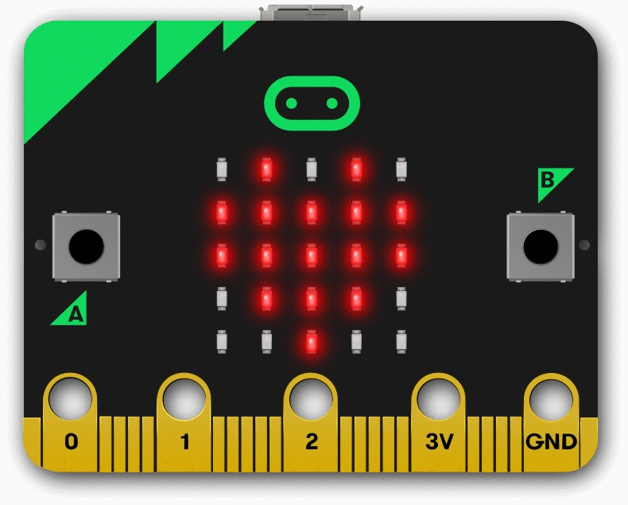

# TP n°1 : Prise en main de la carte Micro:bit

La carte Micro:bit est un mini ordinateur portable et programmable comprenant plusieurs capteurs comme un capteur lumière, de bruit, de température, de tremblement, d'humidité, etc ...

En écrivant un programme en langage Python, il est tout à fait possible de réaliser un système embarqué en fonction de mesures.

Ce TP a pour but de prendre en main la version en ligne de la carte Micro:bit.

## Exercice 1 

a) Aller sur le site [Micro:bit](https://python.microbit.org/v/3/reference) et exécuter le code Python en cliquant sur le bouton de lecture à droite.

b) Modifier le code Python pour que le texte affiché soit `Coucou à tous les amis`.

c) À l'aide de la [Documentation Micro:bit](https://microbit-micropython.readthedocs.io/fr/latest/tutorials/introduction.html), modifier le code Python pour que l'image affichée soit un visage heureux. 

## Exercice 2

La fonction `sleep(n)` bloque l'exécution du code pendant $n$ microsecondes.

À l'aide de la fonction `sleep()`, écrire le code Python permettant de réaliser un cœur qui bat :

## Exercice 3

La fonction `display.set_pixel(x, y, n)` allume la led aux coordonnées $x$ et $y$ d'intensité lumineuse $n$ (avec la première led $x=0$ et $y=0$ située en haut à gauche).

a) Écrire le programme Python allumant toutes les leds de la première ligne.

b) Écrire le programme Python allumant toutes les leds de la première colonne.

## Exercice 4

La fonction `button_a.is_pressed()` renvoie `True` si le bouton **A** est préssé.

À l'aide d'une instruction conditionnelle, écrire le programme Python qui affiche un visage heureux si le bouton **A** est préssé, et un visage triste si c'est le bouton **B** qui est préssé.

## Exercice 5

La fonction `randint(x, y)` renvoie un nombre aléatoire entre $x$ et $y$.

Pour utiliser le module d'aléatoire, il faut d'abord l'importer : `from random import *`.

Écrire un programme Python simulant un dé à six faces, il affiche un nombre aléatoire entre $1$ et $6$ après secoué la carte.

_________________

[Sommaire](./../README.md)
