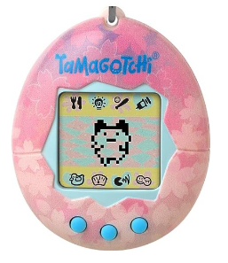

# TP n°2 : Réalisation d'un Tamagotchi

Un Tamagotchi (たまごっち?) est un animal de compagnie virtuel japonais, créé en 1996 par la société japonaise Bandai1. 

Le jeu consiste à simuler l'éducation d'un animal à l'aide d'une console miniature, de la taille d'une montre, dotée d'un programme informatique. 

À l’aide d’une carte Micro:bit, réaliser un système embarqué qui :

- Affiche un sourire quand il est au repos sur la table.

- Devient triste quand on le secoue et le reste pendant cinq secondes.

- Affiche un coeur quand on appuie sur le bouton **A** et le reste pendant trois secondes.

- Affiche un fantôme quand on appuie sur le bouton **B** et le reste pendant trois secondes.

- Affiche le message `Salut ! Je suis ravi de te rencontrer !` quand on appuie à la fois sur le bouton **A** et sur le bouton **B**.

- Affiche le message `J'ai chaud, ne peux-tu pas ouvrir la fenêtre ?` s'il fait plus de 25C°.

- Affiche le message `J'ai froid, ne peux-tu pas allumer le chauffage ?` s'il fait moins de 10C°.

- Allume toutes les Leds s’il fait noir.

- Est supris lorsqu'il est penché soit vers la droite, soit vers la gauche.

______________

[Sommaire](./../README.md)