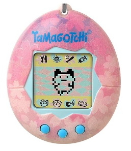

# TP : Réalisation d'un Tamagotchi

Un Tamagotchi (たまごっち?) est un animal de compagnie virtuel japonais, créé en 1996 par la société japonaise Bandai1. 

Le jeu consiste à simuler l'éducation d'un animal à l'aide d'une console miniature, de la taille d'une montre, dotée d'un programme informatique. 

À l’aide d’une carte Micro:bit, réaliser un système embarqué qui :

- affiche un sourire quand il est au repos sur la table.

- devient triste quand on le secoue et le reste pendant cinq secondes

- affiche un coeur quand on appuie sur le bouton **A** et le reste pendant trois secondes

- allume une petite lumière s’il fait noir

- joue de la musique quand on appuie sur le bouton **B**

- vous parle aussi quand on appuie sur le bouton **B**

______________

[Sommaire](./../README.md)