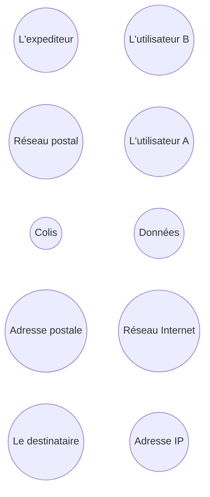

# Adresses IP

## I. Routage des informations

Sur Internet, les équipements informatiques possèdent une adresse pour pouvoir les repérer dans le réseau.

Nous appelons cette adresse : l'*adresse IP*.

En effet, si un utilisateur A souhaite communiquer avec un utilisateur B, il est nécessaire de savoir où envoyer les informations. Pour cela, l'utilisateur A doit connaître l'adresse de l'utilisateur B.

## II. Activité 1

La transmission de données dans un réseau peut être assimilée à la situation suivante :

Un colis est acheminé par voie postale jusqu'à votre maison.

a) Relier les éléments selon la correspondance de leur fonctionnalité :

L'expéditeur -                              - L'utilisateur B

Réseau postal -                             - L'utilisateur A

Colis -                                 - Données

Adresse de la maison -                            - Réseau Internet

Le destinataire -                             - Adresse IP

## III. Adressage des machines

Le *protocole IP* est un protocole délivrant une adresse IP unique pour chaque équipement informatique du réseau.

Une adresse IP est une suite de quatre nombres allant de $0$ à $255$ et peut s'écrire sous la forme : $128.76.0.2$

Chaque adresse est théoriquement unique, il faut donc trouver une stratégie pour trouver autant d'adresse que d'ordinateurs. Par exemple, s'appuyer sur la zone géographique du réseau.

## IV. Activité 2

Nous souhaitons attribuer une adresse IP unique pour chaque élève se trouvant dans la salle de classe.

a) Trouver une stratégie pouvant permettre de trouver une adresse IP théoriquement différente de tous les autres élèves du monde. 

En sachant : que nous sommes en France, dans la région du Nord Pas-de-Calais, à Valenciennes, etc ...

b) En employant votre stratégie, trouver votre adresse IP.

## V. Adresses symboliques

Une *adresse symbolique* (aussi appelée *URL*) est une adresse constituée de mots et menant vers une ressource web. 

Par exemple : https://fr.wikipedia.org/wiki/Informatique est une adresse symbolique.

Les adresses symboliques sont en réalité des adresses IP et le protocole *DNS* (pour *Domain Name System*) se charge de les transformer en adresses un peu plus compréhensibles pour les utilisateurs d'Internet.

## VI. Activité 3

Aller sur [https://www.iplocation.net/ip-lookup](https://www.iplocation.net/ip-lookup) et trouver l'adresse IP de https://fr.wikipedia.org/wiki/Informatique.

___________________

[Sommaire](./../README.md)

