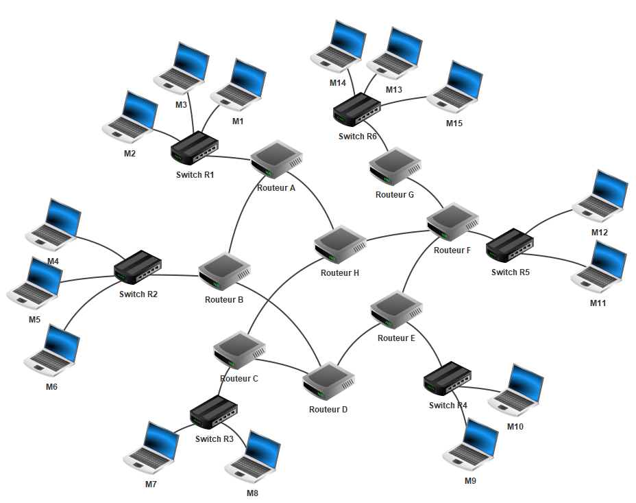
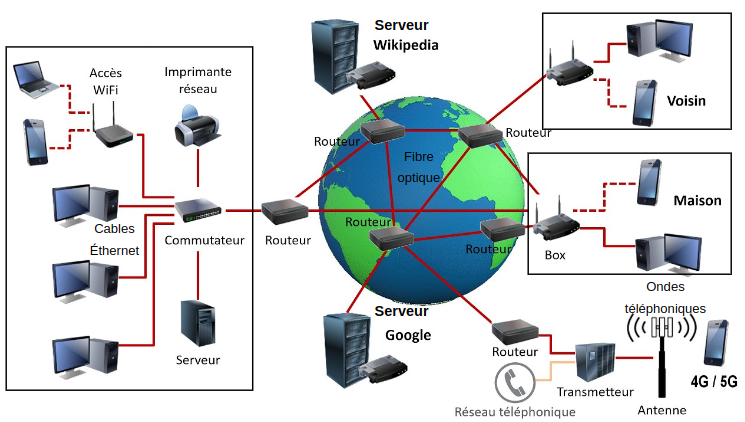

# Réseau Internet

## I. Activité 1

Sur une feuille blanche, dessiner à quoi pourrait ressembler Internet.

## II. Définitions 

*Internet* est un réseau mondial de machines informatiques interconnectées.

Concrètement, Internet est un ensemble de sous-réseaux locaux interconnectés entre eux.

Voici-dessous un exemple de mini-internet :

Internet fonctionne à l'aide de protocoles.

Un *protocole* est un ensemble de règles permettant à deux machines connectées sur Internet de communiquer.

Un *réseau informatique* peut être modélisé sous forme de graphe : c'est un ensemble de machines informatiques (ordinateurs, serveurs, routeurs, ...) reliés ou non par différents types de connexion (câbles de cuivre, fibres optiques, liaisons satellites, ondes radios, ...) en vu d'échanger des données.

## III. Equipements informatiques

### a) Equipements terminaux

- Ordinateurs portables et de bureau.

- Téléphones, téléphones mobiles et smartphones.

- Serveurs web, serveurs DNS et serveurs locaux.

- Périphériques : imprimentes, scanners.

- Objets connectés.

### b) Equipements intermédiaires

- Les *routeurs* indiquent aux informations quel chemin emprunter pour arriver à destination. Ils agissent comme des panneaux d'indication aux usagers de la route.

- Les *commutateurs* (ou *switch* en anglais) permettent de relier plusieurs ordinateurs afin de faire un réseau local.

### c) Types de connexion

- La connexion par cable en cuivre (ex : cable éthernet).

- La connexion par ondes (wifi, bluetooth, satellites, antennes 4G).

- La connexion par fibre optique.

Voici les câbles actuels de fibre optique marins permettant de connecter les continents et les pays entre eux : [https://www.submarinecablemap.com/](https://www.submarinecablemap.com/).

## IV. Classification des réseaux

- Les *LAN* (pour *Local Area Network*) sont des réseaux locaux personnels, internes aux entreprises ou aux écoles.

- Les *MAN* (pour *Metropolitan Area Network*) sont des réseaux de réseaux locaux interconnectés et ont généralement la taille d'une ville.

## V. Activité 2

a) Compléter la légende des équipements informatiques sur le schéma précédent.

b) Compléter la légende des connexions informatiques sur le schéma précédent.

c) Entourer les réseaux locaux sur le schéma précédent.

_______________

[Sommaire](./../README.md)