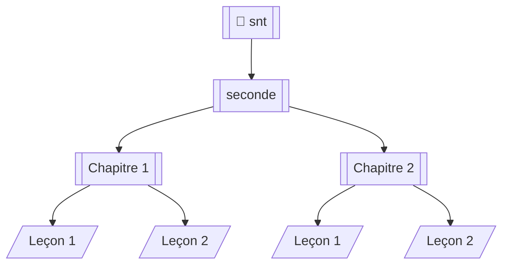

# Introduction

## I. Explorateur de fichiers

```mermaid
    flowchart TB;
        A[[📁 snt]]
        
        A-->B[[seconde]]
        B[[seconde]]-->C[[Chapitre 1]]
        B[[seconde]]-->F[[Chapitre 2]]
        C[[Chapitre 1]]-->D[/Leçon 1/]
        C[[Chapitre 1]]-->E[/Leçon 2/]
        F[[Chapitre 2]]-->G[/Leçon 1/]
        F[[Chapitre 2]]-->H[/Leçon 2/]
```

:file_folder:

## II. L'informatique

En Sciences Numériques et Technologiques, nous allons être amenés à écrire des programmes informatiques.

Un *programme informatique* est un texte composé d'instructions et d'opérations écrit dans un certain langage de programmation et destiné à être exécuté par un ordinateur.

L'*informatique* est la science des **données**, les programmes informatiques que nous écrivons nous permettent de manipuler ces données et d'effectuer des calculs sur celles-ci.

Pour nous aider à écrire des programmes informatiques, les informaticiens utilisent des algorithmes. Un algorithme est une suite d'instructions écrit en Français. Il sert à **résoudre un problème**.

L'objectif de construire un algorithme est qu'il soit compris par tous et qu'on puisse le traduire dans n'importe quel langage de programmation.

Une recette de cuisine est un algorithme.