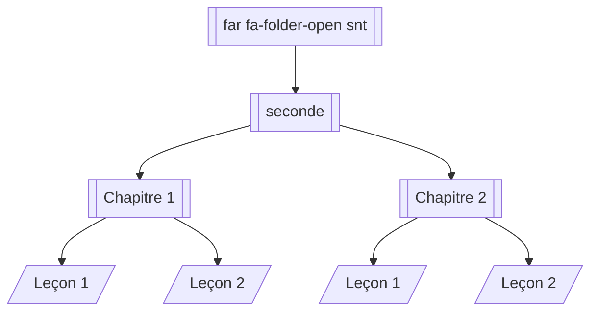

# Introduction

## I. Explorateur de fichiers

## II. L'informatique

En Sciences Numériques et Technologiques, nous allons être amenés à écrire des programmes informatiques.

Un *programme informatique* est un texte composé d'instructions et d'opérations écrit dans un certain langage de programmation et destiné à être exécuté par un ordinateur.

L'*informatique* est la science des **données**, les programmes informatiques que nous écrivons nous permettent de manipuler ces données et d'effectuer des calculs sur celles-ci.

Pour nous aider à écrire des programmes informatiques, les informaticiens utilisent des algorithmes. Un algorithme est une suite d'instructions écrit en Français. Il sert à **résoudre un problème**.

L'objectif de construire un algorithme est qu'il soit compris par tous et qu'on puisse le traduire dans n'importe quel langage de programmation.

Une recette de cuisine est un algorithme.