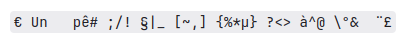

# Prise en main

## I. Ouvrir sa session et accéder au cours

Afin de pouvoir se connecter à une session sur l'ordinateur, munissez-vous de votre *identifiant* et de votre *mot de passe*.

Si vous ne vous êtes pas encore connecté, l'identifiant est `prenom.nom` et le mot de passe est la date de naissance sous la forme `jjmmaa`.

#### <ins>Application 1</ins>

a) Se connecter à sa session.

b) Ouvrir le navigateur web et entrer dans la barre d'adresse le lien suivant : `https://github.com/boddaert/snt`

c) Mettre en favori le lien du cours.

d) Puis, dans le sommaire, cliquer sur `TPn°1 : Prise en main`.

e) Lire le document et faire les applications suivantes.

## III. Gestionnaire de fichiers

## a) Définitions

Un *gestionnaire de fichier* est l'endroit où l'on peut voir, créer ou supprimer des répertoires et des fichiers.

Un *répertoire* (ou un *dossier*) est un endroit pouvant contenir des fichiers ou d'autres répertoires, il est représenté par le dessin suivant : :file_folder:.

Un *fichier* est un contenant d'informations et possède une extension, il est représenté par le dessin suivant : :page_facing_up:.

#### <ins>Application 2</ins>

a) Ouvrir le gestionnaire de fichier, il se trouve généralement dans la barre d'outils en bas de l'écran.

b) Aller dans le lecteur `H:` puis dans le répertoire `Travail` en double-cliquant gauche.

c) Créer un répertoire en cliquant droit sur la surface blanche puis en allant dans `Nouveau` et `Dossier`.

d) Renommer le répertoire nouvellement créé en `snt`.

e) Double-cliquer gauche dessus pour aller dedans.

f) Créer un nouveau répertoire `prise_en_main` puis aller dedans.

g) Créer un fichier texte en cliquant droit sur la surface blanche puis sélectionner `Nouveau` et `Document texte` et nommer le `Ceci est un fichier`.

h) Cliquer droit sur le fichier et sur `ouvrir avec` et choisir le logiciel `Bloc-notes`.

i) Écrire, dans le fichier, votre prénom et votre nom puis aller dans `Fichier` puis `Enregistrer` pour sauvegarder l'état actuel du fichier.

## b) Extensions

L'*extension* d'un fichier indique le type de contenu du fichier. 

Par exemple, s'il s'agit d'un document texte simple, le fichier aura comme extension `.txt`.

#### <ins>Application 3</ins>

a) Dans le gestionnaire de fichier, aller dans l'onglet `Affichage` puis cocher la case `Extensions de noms de fichier`.

b) Vérifier que votre fichier document texte créé à l'application n°2 porte bien l'extension `.txt`.

c) Cliquer gauche sur le fichier et supprimer le fichier. Le fichier supprimé se retrouve dans la corbeille.

#### <ins>Application 4</ins>

| Extension de fichier | Type de contenu | Logiciel/Application permettant d'ouvrir ce type de fichier |
| --- | --- | --- |
| `.txt` | Texte | Bloc-notes |
| `.odt` | | |
| `.mp3` | | |
| `.png` | | |
| `.pdf` | | |
| `.gif` | | |
| `.py` | | |
| `.csv` | | |

a) Recopier le tableau ci-dessus dans un fichier `Extensions_de_fichiers.txt`.

b) Trouver, sur le web, les informations permettant de compléter le tableau précédent.

### c) Lecteurs

Chaque utilisateur du lycée se voit affecter des lecteurs réseau lors de l'ouverture de la session.

Il y a le lecteur :

- `H:`, il s'agit du lecteur personnel de l'utilisateur, c'est ici que vous allez pouvoir enregistrer vos fichiers. Tous les professeurs y ont accès.

- `M:`, il s'agit du lecteur public, c'est ici que vos professeurs peuvent mettre des documents à votre disposition que vous pourrez récupérer en copiant-collant dans vos espaces de travail.

### d) Arborescence

Nous représentons schématiquement l'ensemble des répertoires et des fichiers sous la forme d'une arborescence.

Voici ci-dessous l'arborescence actuelle de votre répertoire `H:` :

- :file_folder: `H:`
    - :file_folder: `Corbeille`
    - :file_folder: `Travail`
        - :file_folder: `snt`
            - :file_folder: `prise_en_main`
                - :page_facing_up: `extensions_de_fichiers.txt`

Comme dans un arbre généalogique, nous parlons de répertoires ou de fichiers *parents* et de répertoires ou de fichiers *enfants*.

Par exemple, le répertoire `snt` se trouve dans le répertoire `Travail`, le répertoire `Travail` est donc le parent de `snt` et le répertoire `snt` est enfant du répertoire `Travail`.

Dans cette arborescence, le répertoire `H:` est le *répertoire racine*, il est parent de tous les autres répertoires et fichiers.

#### <ins>Application 5</ins>

Répondre aux questions suivantes dans un fichier `arborescence.txt` situé dans le même répertoire :

1. Le répertoire `Corbeille` est-il enfant du réperoire `H:` ?

2. Le répertoire `H:` est-il parent du répertoire `Travail` ?

3. Le répertoire `Travail` est-il parent du répertoire `snt` ?

#### <ins>Application 6</ins>

Créer les répertoires et les fichiers nécessaires pour que votre espace de travail corresponde à l'arborescence suivante :

- :file_folder: `H:`
    - :file_folder: `Corbeille`
    - :file_folder: `Travail`
        - :file_folder: `snt`
            - :file_folder: `img`
            - :file_folder: `web`
            - :file_folder: `internet`
            - :file_folder: `reseaux_sociaux`
            - :file_folder: `prise_en_main`
                - :page_facing_up: `xtensions__de_fichiers.txt`
                - :page_facing_up: `arborescence.txt`
                - :page_facing_up: `dictee.txt`

#### <ins>Application 7</ins>

a) Aller sur le web et écrire dans la barre de recherche le nom de votre animal favori.

b) Cliquer sur l'onglet `Images` et choisir une image.

c) Enregistrer l'image dans votre répertoire `img` de votre lecteur `H:` en cliquant droit sur l'image choisie puis `Enregistrer sous`. Nommer l'image `mon_animal_favori`.

## III. Le clavier

Le *clavier* est un périphérique d'entrée utilisé pour écrire sur l'écran en pressant les touches.

En France, les claviers sont généralement de type **azerty**.

### a) Les touches indispensables

- `Maj` : Une fois préssée, le mode majuscule des lettres est activée.
- `Shift` : Active le mode majuscule des lettres si la touche `Shift` est préssée.
- `Ctrl` : La touche de contrôle, en combinaison avec d'autres touches, permet d'accèder à d'autres fonctionnalités.
- `Windows` : Permet d'ouvrir le menu `Démarrer` de Windows.
- `Tab` : La touche de tabulation marque un fort espace de caractère.
- `Alt` : Permettant, en combinaison avec d'autres touches, d'accèder à d'autres fonctionnalités.
- `Alt Gr` : En etant préssée, cette touche permet d'accèder à d'autres caractères.

De manière générale, le caractère figurant : 

- En bas à droite d'une touche s'obtient avec la combinaison `Alt Gr`.
- En haut d'une touche s'obtient avec la combinaison `Shift`.

| Caractère | Touches utilisées |
| --- | --- |
| `/` | `Shift` + `:` |
| `>` | `Shift` + `<` |
| `#` | `Alt Gr` + `"` |
| `@` | `Alt Gr` + `à` |
| `ê` | `^` puis `e` |
| `ë` | `Shift` + `^` puis `e` |
| `€` | `Alt Gr` + `e` |
| `æ` | `Alt Gr` + `g` |

#### <ins>Application 8</ins>

a) Ouvrir le fichier `dictee.txt` en cliquant droit puis `ouvrir avec` et `Bloc-notes`.

b) Recopier, dans le fichier `dictee.txt` et en utilisant uniquement les touches du clavier le texte suivant :

## IV. Envoyer un mail

#### <ins>Application 9</ins>

Via l'ENT ou votre application favorite, envoyer par mail votre dictée :

- Mon adresse mail est écrite sur la page de garde du cours de SNT.

- Préciser votre prénom/nom/classe ainsi que l'objet du mail.

- Ne pas oublier la dictée mise en pièce jointe au mail.

- Ajouter les formules de politesse.

________________

[Sommaire](./../../README.md)
