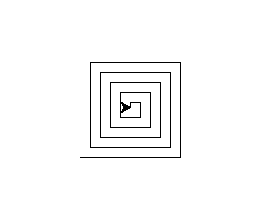
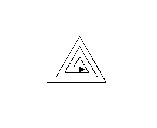
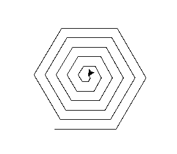

# Projet : Sprirales

## I. Objectif

L'objectif est d'écrire un programme Python qui demande à l'utilisateur ce qu'il veut dessiner comme spirale.

Le programme Python que vous devrez écrire doit proposer trois types de spirales :

- Le carré :



- Le triangle :



- L'hexagone :



## II. Travail à faire

a) Écrire une fonction `carre(x, y, n)` qui prend en paramètre trois entiers et dessine, à l'aide de Turtle, une spirale en forme de carré à la position $(x,y)$ avec le premier côté mesurant $n$.

b) Écrire une fonction `triangle(x, y, n)` qui prend en paramètre trois entiers et dessine, à l'aide de Turtle, une spirale en forme de triangle à la position $(x,y)$ avec le premier côté mesurant $n$.

c) Écrire une fonction `hexagone(x, y, n)` qui prend en paramètre trois entiers et dessine, à l'aide de Turtle, une spirale en forme d'un hexagone à la position $(x,y)$ avec le premier côté mesurant $n$.

d) Écrire le code Python demandant à l'utilisateur quel forme il veut dessiner et à quelle position. 

Voici ci-dessous un exemple d'interraction qu'il pourrait y avoir avec l'utilisateur :

```
Quelle forme de spirale voulez-vous dessiner ?

1 - Carré
2 - Triangle
3 - Hexagone

À quelle position x et y voulez-vous le dessiner ?

x ?
y ?
```
________________

[Sommaire](./../README.md)