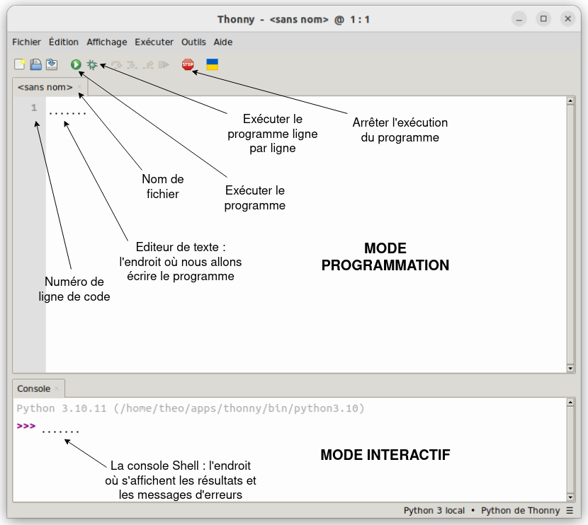

# Thonny

## I. Environnement de développement

Un *IDE* (ou environnement de développement) est un logiciel permettant d'écrire et de faire exécuter des programmes.

Nous utiliserons pour cela le logiciel Thonny :

Sur Thonny, il y a un **mode programmation** et un **mode interactif**.

### a) Mode programmation

Le mode programmation de Thonny est l'endroit où l'on va écrire nos programmes. C'est ce texte qui sera enregistré sur le fichier.

Par exemple, je crée un fichier vide `test.py` (la terminaison `.py` indique qu'il s'agit bien d'un fichier python), puis j'écris un programme informatique qui réalise la somme de $5$ et $5$.

Enfin, en cliquant sur le bouton d'exécution, j'exécute le programme.

Nous devrions, à l'issue de cette manipulation, arriver à un état comme celui-ci :

Nous constatons plusieurs choses :

- Premièrement, le programme a bien été enregistré sur le fichier puisque si je ferme le fichier et le réouvre avec Thonny, je retrouve le programme écrit.

- Deuxièmement, le code a bien été éxécuté puisque dans la console du mode interactif, l'instruction `run test.py` le prouve.

- Troisièmement, aucun résultat ne s'affiche.

Aucun résultat ne s'est affiché et c'est tout à fait normal, je n'ai pas écris dans mon programme l'instruction permettant d'afficher mon résultat.

Donc, mon programme a bien effectué la somme de $5$ et $5$ mais n'a rien effectué de plus.

##### Exercice 1

- Ouvrir le logiciel Thonny.

- Sur Thonny, créer le fichier `test_mon-nom.py`.

- Ecrire votre premier programme informatique python, qui réalise l'opération suivante : `(5+3)-(4*2)`.

Le programme s'exécute t-il ?

##### Exercice 2

Remplacer l'opération de l'application 1 par `5 + * 3`

Le programme s'exécute t-il correctement ? 

Qu'est-il écrit sur la console ?

### b) Mode interactif

La console situé en bas de la page se présente comme une calculatrice.

Les trois chevrons **>>>** indique que la console attend une instruction.

Par exemple, j'efface mon précédent programme, je réexécute le programme vierge (rien ne se passe) et j'écris dans la console l'opération permettant de faire la somme de $5$ et $5$, puis en appuyant sur `Entrée`, je me retrouve dans l'état suivant :

Ici aussi, nous constatons plusieurs choses :

- Premièrement, le résultat de l'opération s'affiche et la console attend de nouveau une instruction.

- Deuxièmement, si je ferme et réouvre le fichier, les instructions précédemment écrites dans la console sont perdues.

Le mode interactif ne permet pas d'enregistrer sur le fichier des programmes.

On utilise généralement le mode interactif pour tester ses programmes ou ses instructions.

#### Exercice 3

Répéter les opérations des applications n°1 et n°2 en utilisant cette fois uniquement le mode interactif de Thonny.

________

[Leçon n°3 : Types](./Types.md)

________

[Sommaire](./../../seconde/)