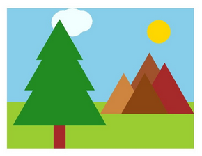

# Projet : Écrire son prénom

## I. Description

En Python et à l'aide du module `turtle`, vous devrez dessiner un paysage.

Cela peut être un paysage de plage, de montagne, de ville ...

Le projet est ouvert mais doit comporter au moins cinq éléments graphiques.

Par exemple, les éléments graphiques qui composent le paysage suivant sont  : montagnes, soleil, arbre, nuage et arrière-plan (ciel et plaine).

## II. Module Turtle

Le module `turtle` permet de dessiner dans un repère orthonormé.

Les fonctions incluses dans ce module permettent de déplacer une tortue munie d'un crayon dans le repère.

La tortue commence au point de coordonnées $(0,0)$ et est dirigée vers la droite.

Voici quelques fonctions simples pour commencer à utiliser `turtle` :

| Fonctions disponibles | Description |
|---|---|
| `mainloop()` | Empêche la fermeture de la fenêtre |
| `forward(d)` | La tortue avance de $d$ points. |
| `backward(d)` | La tortue recule de $d$ points. |
| `left(a)` | La tortue pivote à gauche de l'angle $a$. |
| `right(a)` | La tortue pivote à droite de l'angle $a$ |
| `circle(r, a)` | La tortue trace un arc de cercle d'angle $a$ et de rayon $r$. |
| `dot(r)` | La tortue trace un point de rayon $r$. |
| `goto(x, y)` | La tortue se déplace au point de coordonnées $(x,y)$. |
| `up()` | La tortue relève son crayon. |
| `down()` | La tortue pose son crayon. |
| `width(e)` | La tortue trace d'une épaisseur $e$. |
| `color(c)` | La tortue trace d'une couleur $c$. |
| `begin_fill()` | La tortue active le mode remplissage. |
| `end_fill()` | La tortue désactive le mode remplissage. |
| `fillcolor(c)` | La tortue sélectionne la couleur $c$ pour le mode remplissage. |
| `speed(s)` | La tortue se déplace d'une vitesse $s$. |
| `ht()` | La tortue est invisible. |

## III. Évaluation

Vous serez évalués sur :

- La qualité du rendu (les lettres sont correctement déssinées)

- La qualité du code fourni (lisibilité du code, explicité des noms de variable)

______________

[Sommaire](./../../README.md)