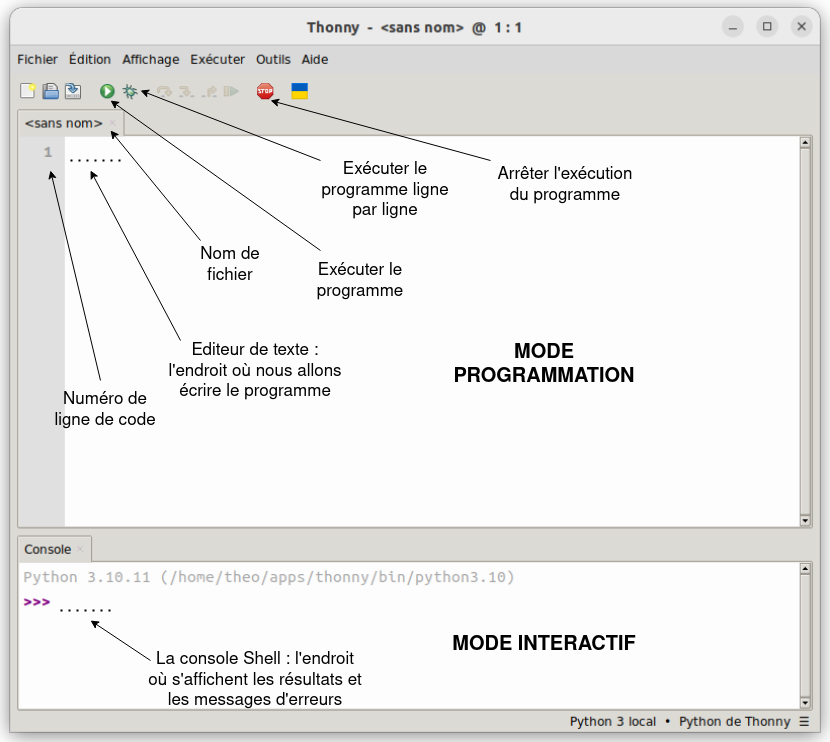

# Thonny

## I. Environnement de développement

Un *IDE* (ou environnement de développement) est un logiciel permettant d'écrire et de faire exécuter des programmes.

Nous utiliserons pour cela le logiciel Thonny :

Sur Thonny, il y a un **mode programmation** et un **mode interactif**.

### a) Mode programmation

Le mode programmation de Thonny est l'endroit où l'on va écrire nos programmes. C'est ce texte qui sera enregistré sur le fichier.

### b) Mode interactif

La console situé en bas de la page se présente comme une calculatrice.

Les trois chevrons **>>>** indique que la console attend une instruction en Python, l'instruction peut être une demande pour exécuter notre programme pour tester la présence de bugs.

________

[Sommaire](./../../README.md)