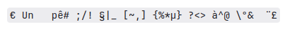
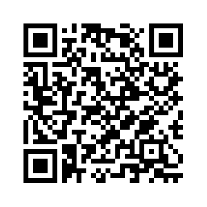

# Prise en main

## I. Ouvrir sa session

Afin de pouvoir se connecter à une session sur l'ordinateur, munissez-vous de votre *identifiant* et de votre *mot de passe*.

Si vous ne vous êtes pas encore connecté, l'identifiant est `prenom.nom` et le mot de passe est la date de naissance sous la forme `jjmmaa`.

##### Application 1

a) Se connecter à sa session.

b) Ouvrir le navigateur web et entrer dans la barre d'adresse le lien suivant : `https://github.com/boddaert/snt`

c) Mettre en favori le lien du cours.

d) Puis, dans le sommaire, cliquer sur `Prise en main`.

e) Lire le document et faire les applications.

## II. Gestionnaire de fichiers

## a) Définitions

Un *gestionnaire de fichier* est l'endroit où l'on peut voir, créer ou supprimer des répertoires et des fichiers.

Un *répertoire* (ou un *dossier*) est un endroit pouvant contenir des fichiers ou d'autres répertoires, il est représenté par le dessin suivant : :file_folder:.

Un *fichier* est un contenant d'informations et possède une extension, il est représenté par le dessin suivant : :page_facing_up:.

##### Application 2

a) Ouvrir le gestionnaire de fichier, il se trouve généralement dans la barre d'outils en bas de l'écran.

b) Aller dans le lecteur `H:` puis dans le répertoire `Travail` en double-cliquant gauche.

c) Créer un répertoire en cliquant droit sur la surface blanche puis en allant dans `Nouveau` et `Dossier`.

d) Renommer le répertoire nouvellement créé en `snt`.

e) Double-cliquer gauche dessus pour aller dedans.

f) Créer un fichier texte en cliquant droit sur la surface blanche puis sélectionner `Nouveau` et `Document texte` et nommer le `Ceci est un fichier`.

g) Cliquer droit sur le fichier et sur `ouvrir avec` et choisir le logiciel `Bloc-notes`.

h) Ecrire, dans le fichier, votre prénom et votre nom puis aller dans `Fichier` puis `Enregistrer` pour sauvegarder l'état actuel du fichier.

## b) Extensions

L'*extension* d'un fichier indique le type de contenu du fichier. 

Par exemple, s'il s'agit d'un document texte simple, le fichier aura comme extension `.txt`.

##### Application 3

a) Dans le gestionnaire de fichier, aller dans l'onglet `Affichage` puis cocher la case `Extensions de noms de fichier`.

b) Vérifier que votre fichier document texte crée à l'application n°2 porte bien l'extension `.txt`.

c) Cliquer gauche sur le fichier et supprimer le fichier. Le fichier supprimé se retrouve dans la corbeille.

##### Application 4

| Extension de fichier | Type de contenu | Logiciel/Application permettant d'ouvrir ce type de fichier |
| --- | --- | --- |
| `.txt` | Texte | Bloc-notes |
| `.odt` | | |
| `.mp3` | | |
| `.png` | | |
| `.pdf` | | |
| `.gif` | | |
| `.py` | | |
| `.csv` | | |

a) Recopier le tableau ci-dessus sur une feuille.

b) Trouver, sur le web, les informations permettant de compléter le tableau précédent.

### c) Lecteurs

Chaque utilisateur du lycée se voit affecter des lecteurs réseau lors de l'ouverture de la session.

Il y a le lecteur :

- `H:`, il s'agit du lecteur personnel de l'utilisateur, c'est ici que vous allez pouvoir enregistrer vos fichiers. Tous les professeurs y ont accès.

- `M:`, il s'agit du lecteur public, c'est ici que vos professeurs peuvent mettre des documents à votre disposition que vous pourrez récupérer en copiant-collant dans vos espaces de travail.

### d) Arborescence

Nous représentons schématiquement l'ensemble des répertoires et des fichiers sous la forme d'une arborescence.

Voici ci-dessous l'arborescence actuelle de votre répertoire `H:` :

- :file_folder: `H:`
    - :file_folder: `Corbeille`
    - :file_folder: `Travail`
        - :file_folder: `snt`
            - :page_facing_up: `Ceci est un fichier.txt`

Comme dans un arbre généalogique, nous parlons de répertoires ou de fichiers *parents* et de répertoires ou de fichiers *enfants*.

Par exemple, le répertoire `snt` se trouve dans le répertoire `Travail`, le répertoire `Travail` est donc le parent de `snt` et le répertoire `snt` est enfant du répertoire `Travail`.

Dans cette arborescence, le répertoire `H:` est le *répertoire racine*, il est parent de tous les autres répertoires et fichiers.

##### Application 5

Répondre aux questions suivantes sur feuille :

1. Le répertoire `Corbeille` est-il enfant du réperoire `H:` ?

2. Le répertoire `H:` est-il parent du répertoire `Travail` ?

3. Le répertoire `Travail` est-il parent du répertoire `snt` ?

##### Application 6

Créer les répertoires et les fichiers nécessaires pour que votre espace de travail corresponde à l'arborescence suivante :

- :file_folder: `H:`
    - :file_folder: `Images`
    - :file_folder: `Corbeille`
    - :file_folder: `Travail`
        - :file_folder: `snt`
            - :page_facing_up: `Ceci est un fichier.txt`
            - :file_folder: `nom_prenom_Chapitre_0_prise_en_main`
                - :page_facing_up: `nom_prenom_dictee.txt`

##### Application 7

a) Aller sur le web et écrire dans la barre de recherche le nom de votre animal favori.

b) Cliquer sur l'onglet `Images` et choisir une image.

c) Enregistrer l'image dans votre répertoire `Images` de votre lecteur `H:` en cliquant droit sur l'image choisie puis `Enregistrer sous`. Nommer l'image `mon_animal_favori`.

### e) Chemins

Pour donner le nom d'un fichier, nous donnons généralement en plus le chemin vers ce fichier.

Un *chemin* démarre depuis la racine et traverse tous les répertoires jusqu'au fichier.

Dans un chemin, les répertoires sont séparés par des `/`.

Par exemple :

- Le chemin du fichier `Ceci est un fichier.txt` est `H:/Travail/snt/Ceci est un fichier.txt`.

##### Application 8

a) Donner le chemin du fichier `nom_prenom_dictee.txt`.

b) Vérifier votre résultat en cliquant droit sur le fichier `nom_prenom_dictee.txt` puis sélectionner `Propriétés` puis `Détails`.

## III. Le clavier

Le *clavier* est un périphérique d'entrée utilisé pour écrire sur l'écran en pressant les touches.

En France, les claviers sont généralement de type **azerty**.

### a) Les touches indispensables

- `Maj` : Une fois préssée, le mode majuscule des lettres est activée.
- `Shift` : Active le mode majuscule des lettres si la touche `Shift` est préssée.
- `Ctrl` : La touche de contrôle, en combinaison avec d'autres touches, permet d'accèder à d'autres fonctionnalités.
- `Windows` : Permet d'ouvrir le menu `Démarrer` de Windows.
- `Tab` : La touche de tabulation marque un fort espace de caractère.
- `Alt` : Permettant, en combinaison avec d'autres touches, d'accèder à d'autres fonctionnalités.
- `Alt Gr` : En etant préssée, cette touche permet d'accèder à d'autres caractères.

De manière générale, le caractère figurant : 

- En bas à droite d'une touche s'obtient avec la combinaison `Alt Gr`.
- En haut d'une touche s'obtient avec la combinaison `Shift`.

| Caractère | Touches utilisées |
| --- | --- |
| `/` | `Shift` + `:` |
| `>` | `Shift` + `<` |
| `#` | `Alt Gr` + `"` |
| `@` | `Alt Gr` + `à` |
| `ê` | `^` puis `e` |
| `ë` | `Shift` + `^` puis `e` |
| `€` | `Alt Gr` + `e` |
| `æ` | `Alt Gr` + `g` |

##### Application 9

a) Ouvrir le fichier `nom_prenom_dictee.txt` en cliquant droit puis `ouvrir avec` et `Bloc-notes`.

b) Recopier, dans le fichier `nom_prenom_dictee.txt` et en utilisant uniquement les touches du clavier le texte suivant :

## IV. L'Environnement Numérique de Travail (ENT)

L'ENT est un endroit comportant plusieurs outils pratiques comme :

- Néo, une messagerie interne au lycée.
- Pronote, permettant de visualiser les notes aux évaluations, l'emploi du temps et les devoirs.
- D'autres outils pédagogiques.

Pour s'y connecter, il faut être en possession d'un compte Educonnect dont les identifiants sont fournis en début d'année.

##### Application 10

a) Aller sur l'adresse [https://connexion.enthdf.fr/](https://connexion.enthdf.fr/) pour vous connecter à l'ENT.

b) Mettre en favori le site de l'ENT.

c) Cliquer sur l'icône de messagerie.

d) Envoyer un mail à M.Boddaert (moi).

Le mail envoyé doit contenir :

- Un _objet_ expliquant brièvement le sujet du mail.

- Le nom du destinataire avec une formule de politesse tel que *Monsieur, Madame*.

- Le texte.

- Les formules de politesse habituelles pour conclure le texte du mail tel que _Cordialement,_.

- Votre nom et prénom en guise de signature.

- Votre fichier `nom_prenom_dictee.txt` en pièce jointe.

Pour ajouter un fichier dans un mail : il faut cliquer sur _ajouter une pièce jointe_ sur l'icône :paperclip: et sélectionner le fichier que vous voulez transmettre.

## V. Google Classroom

En tant qu'élève du Lycée de l'Escaut, vous avez également accès à l'outil Google Classroom.

##### Application 11

a) Aller sur [google.com/classroom](https://edu.google.com/intl/fr_fr/workspace-for-education/classroom/) puis sélectionner `Connexion` puis `Google classroom`.

b) Pour vous connecter, écrire votre adresse gmail du lycée sous la forme `prenom.nom@lycee-escaut.fr`.

c) Le mot de passe est la date de naissance sous le format `jjmmaa`.

## VI. QR Code

Il se peut que dans vos manuels scolaire y figure des QR Code.

Le QR Code est un type de code-barres à deux dimensions constitué de modules-carrés noirs disposés dans un carré à fond blanc.

Ces points définissent l'information que contient le code, il s'agit le plus souvent de lien vers un site web.

##### Application 12

a) Installer sur votre téléphone le scanner QR Code de votre choix.

b) A l'aide de votre téléphone, scanner le QR Code suivant :

________________

[Sommaire](./../README.md)
