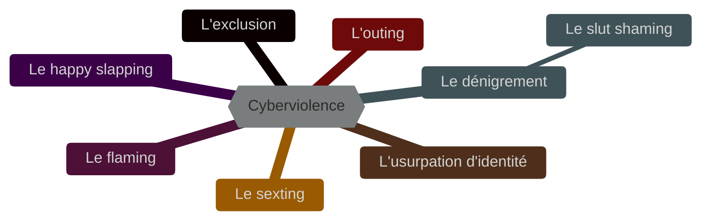

# Cyberviolence

## I. Définitions

La *cyberviolence* est un acte agressif et intentionnel. Organisé à l'encontre d'une victime par un ou plusieurs individus sur un média social.

La cyberviolence peut prendre plusieurs formes, nous en comptons sept :

L'*exclusion* consiste à exclure une personne d’un regroupement social en ligne (ex : un groupe Facebook). La personne exclue peut faire, au sein du groupe, l’objet de moqueries.

Le *flaming* consiste à envoyer un message violent (insultant, menaçant) et plus particulièrement une “salve” de messages à destination d’une personne ou d’un groupe de personnes.

Le *dénigrement* consiste à décrédibiliser une personne, à porter atteinte à son image, à sa réputation, à lancer toute sorte de rumeurs à son égard.

Le *slut shaming* qui est une forme de dénigrement, touchant particulièrement les jeunes filles, consiste à blâmer et à déconsidérer celles dont la tenue vestimentaire, le maquillage, l’attitude voire les activités sexuelles ne correspondent pas aux normes en vigueur dans un groupe d’adolescents.

L’*usurpation d’identité* consiste à usurper l’identité de quelqu’un en accédant à sa messagerie ou à son profil, à se faire passer pour lui pour envoyer ou publier des messages embarrassants/humiliants.

L’*outing* consiste à divulguer des informations intimes et /ou confidentielles sur une personne sans son accord.

Le *happy slapping* consiste à filmer, le plus souvent à l’aide d’un téléphone portable, une scène de violence subie par une personne et à diffuser la vidéo en ligne.

Le *sexting* renvoie au fait d’envoyer des textos, des photographies ou encore des vidéos à caractère explicitement sexuel à une personne sans son accord.

## II. Cyberharcèlement

Le *harcèlement* se définit comme une violence répétée qui peut être verbale, physique ou psychologique.

Cette violence existe aussi bien au sein de l'école que sur les médias sociaux, nous l'appelons alors le *cyberharcèlement*.