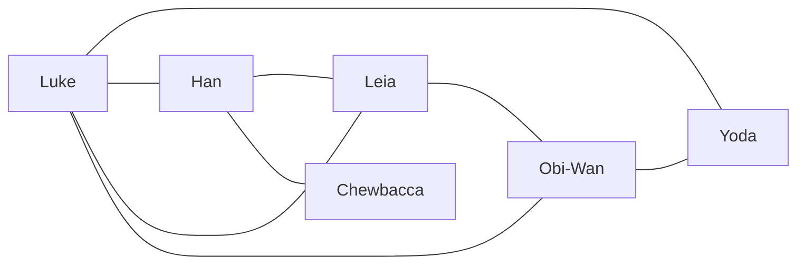

# Graphes

## a) Définitions

Un *graphe* est un ensemble de noeuds appelés *sommets* reliés entre eux par des *arêtes*.

Un *graphe* est orienté si les arêtes ont un sens (nous parlons alors d'*arcs*) et non orienté dans le cas contraire.

Nous représentons un média social sous forme de graphe avec comme sommets les utilisateurs et comme arêtes les liens d'amitié.

## b) Activité 1

1. Représentation du graphe n°1 (non orienté) :



2. Représentation du graphe n°2 (orienté) :

```mermaid
    flowchart LR
        Anakin --> Obi-Wan
        Obi-Wan --> Anakin
        Anakin --> Padmé
        Padmé --> Anakin
        Qui-gon --> Obi-Wan
        Qui-gon --> Yoda
        Obi-Wan --> Yoda
        Anakin --> Chancelier
        Chancelier --> Dark Maul
```

a) A quel type de graphe le média social Facebook correspond t-il le mieux ? Pourquoi ?

b) A quel type de graphe le média social Twitter correspond t-il le mieux ? Pourquoi ?

Deux sommets d'un graphe sont *adjacents* (ou *voisins*) s'il existe une arête entre ces deux sommets.

Dans un graphe orienté, le sommet `b` est adjacent du sommet `a` s'il existe un arc allant de `a` vers `b`.

c) Pour les deux graphes, quels sont les sommets adjacents de Luke ?

Un *chemin* reliant un sommet `a` à un sommet `b` est une suite de sommets adjacents consécutifs commençant par `a` et finissant par `b`.

d) Pour les deux graphes, donner plusieurs chemins possibles reliant Luke à Chewbacca.

La *longueur d'un chemin* est le nombre de sommet traversés.

e) Donner les longueurs des chemins trouvés à la question précédente.

La *distance* entre un sommet `a` et `b` est le minimum des longueurs de chemins reliant `a` à `b`.

f) Donner la distance entre Luke et Chewbacca pour les deux graphes.

## c) Représentations des graphes en machine

Les graphes en machine peuvent être représentés de deux façons différentes :

- Par matrice d'adjacence.
- Par listes d'adjacence.

Une *matrice d'adjacence* est un tableau à deux dimensions de taille $N*N$ cases pour un graphe comprenant $N$ sommets.

Et pour chaque case, nous indiquons si le sommet de la colonne est adjacent du sommet de la ligne.

Par exemple, le graphe n°1 est représenté en machine par la matrice d'adjacence suivante :

| | Luke | Leia | Han | Yoda | Chewbacca | Obi-Wan |
| --- | --- | --- | --- | --- | --- | --- |
| Luke | x | x | x | x | | x |
| Leia | x | x | x | | | x |
| Han | x | x | x | | x | |
| Yoda | x | | | x | | x |
| Chewbacca | | | x | | x | |
| Obi-Wan | x | x | | x | | x |

Une *liste d'adjacence* est une liste de sommets et pour chacun de ces sommets indique ses voisins.

Par exemple, le graphe n°2 peut être représenté par la liste d'adjacence suivante :

Luke : Leia, Han, Yoda, Obi-Wan.
Leia : Obi-Wan, Han, Luke.
Han : Chewbacca.
Yoda : Obi-Wan.
Chewbacca : Han.
Obi-Wan : Yoda.