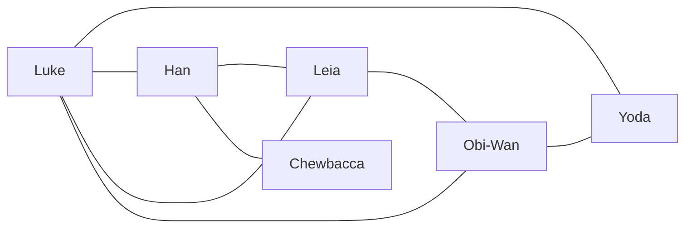
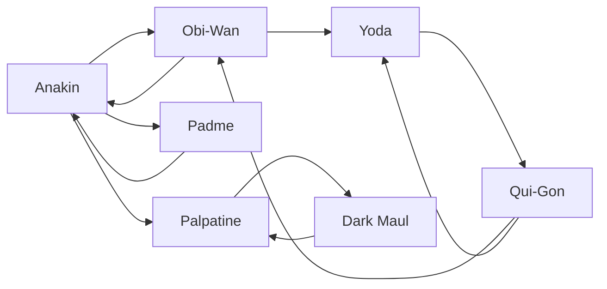

# Graphes

## a) Définitions

Un *graphe* est un ensemble de noeuds appelés *sommets* reliés entre eux par des *arêtes*.

Un *graphe* est orienté si les arêtes ont un sens (nous parlons alors d'*arcs*) et non orienté dans le cas contraire.

Nous représentons un média social sous forme de graphe avec comme sommets les utilisateurs et comme arêtes les liens d'amitié.

## b) Activité 1

1. Représentation du graphe n°1 :

2. Représentation du graphe n°2 :

a) Quel est le type de graphe du graphe n°1 ?

b) Quel est le type de graphe du graphe n°2 ?

c) Donner la liste des sommmets du graphe n°1.

d) Donner la liste des sommets du graphe n°2.

e) A quel type de graphe le média social Facebook correspond t-il le mieux ? Pourquoi ?

f) A quel type de graphe le média social Twitter correspond t-il le mieux ? Pourquoi ?

## c) Autres définitions

Deux sommets d'un graphe sont *adjacents* (ou *voisins*) s'il existe une arête entre ces deux sommets.

Dans un graphe orienté, le sommet `b` est adjacent du sommet `a` s'il existe un arc allant de `a` vers `b`.

Un *chemin* reliant un sommet `a` à un sommet `b` est une suite de sommets adjacents consécutifs commençant par `a` et finissant par `b`.

La *longueur d'un chemin* est le nombre de sommet traversés.

La *distance* entre un sommet `a` et `b` est le minimum des longueurs de chemins reliant `a` à `b`.

## d) Activité 2

a) Donner les sommets adjacents de `Luke` dans le graphe n°1.

b) Donner les sommets adjacents de `Anakin` dans le graphe n°2.

c) Donner plusieurs chemins possibles reliant `Luke` à `Chewbacca` dans le graphe n°1.

d) Donner plusieurs chemins possibles reliant `Anakin` à `Dark Maul`.

e) Donner les longueurs des chemins trouvés aux deux questions précédentes.

f) En déduire la distance entre `Luke` et `Chewbacca`.

g) En déduire la distance entre `Anakin` et `Dark Maul`.

## e) Représentations des graphes en machine

Les graphes en machine peuvent être représentés de deux façons différentes :

- Par matrice d'adjacence.
- Par listes d'adjacence.

Une *matrice d'adjacence* est un tableau à deux dimensions de taille $N*N$ cases pour un graphe comprenant $N$ sommets.

Et pour chaque case, nous indiquons si le sommet de la colonne est adjacent du sommet de la ligne.

Par exemple, le graphe n°1 est représenté en machine par la matrice d'adjacence suivante :

| | Luke | Leia | Han | Yoda | Chewbacca | Obi-Wan |
| --- | --- | --- | --- | --- | --- | --- |
| Luke | x | x | x | x | | x |
| Leia | x | x | x | | | x |
| Han | x | x | x | | x | |
| Yoda | x | | | x | | x |
| Chewbacca | | | x | | x | |
| Obi-Wan | x | x | | x | | x |

Une *liste d'adjacence* est une liste de sommets et pour chacun de ces sommets indique ses voisins.

Par exemple, le graphe n°2 peut être représenté par la liste d'adjacence suivante :

Qui-Gon : Yoda, Obi-Wan.
Anakin : Padme, Obi-Wan, Palpatine.
Palpatine : Dark Maul.
Obi-Wan : Yoda, Anakin.
Padme : Anakin.
Yoda : Qui-gon.