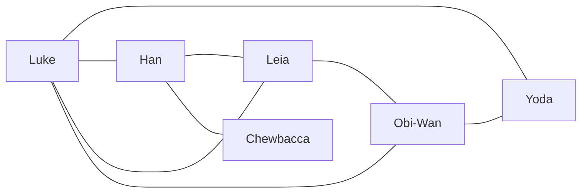

# Graphes

## a) Définitions

Un *graphe* est un ensemble de noeuds appelés *sommets* reliés entre eux par des *arêtes*.

Un *graphe* est orienté si les arêtes ont un sens (nous parlons alors d'*arcs*) et non orienté dans le cas contraire.

Nous représentons un média social sous forme de graphe avec comme sommets les utilisateurs et comme arêtes les liens d'amitié.

## b) Activité 1

