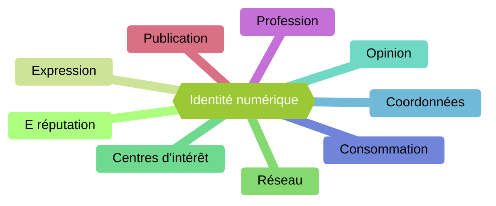

# Identité numérique

## a) Définition

L'*identité numérique* est l'ensemble des traces que nous laissons sur le web et les médias sociaux.

L'identité numérique est constituée de neuf sous-catégories :

L'*e-réputation* est l'image que les autres utilisateurs nous donne. Elle peut être positive comme négative.

Il est important de contrôler son identité numérique afin de protéger son e-réputation.

## b) Activité 1

Construire votre propre identité numérique en associant un exemple de phrase ou de situation pour chacune des neuf sous-catégories.

_____________

Leçon 4 : [Petit Monde](./Petit_monde.md)