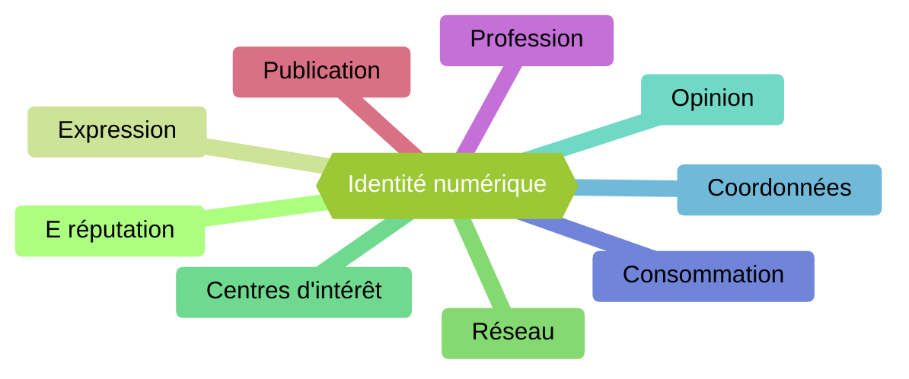

# Identité numérique

## I. Définition

L'*identité numérique* est l'ensemble des traces que nous laissons sur le web et les médias sociaux.

L'identité numérique est constituée de neuf sous-catégories :

L'*e-réputation* est l'image que les autres utilisateurs me donne. Elle peut être positive comme négative.

La *consommation* est l'ensemble des achats que j'ai réalisé, le moyen de paiement, la fréquence d'achat, etc ...

L'*expression* regroupe l'ensemble de ce que j'ai dis sur un média social.

Le *réseau* représente l'ensemble des utilisateurs que je connais.

Les *coordonnées* regroupe tous les moyens de communications pour me joindre.

Les *centres d'intérêt* décrivent tout ce que j'aime.

L'*opinion* est ce que je pense. Elle peut être de nature politique, religieuse ou philosophique.

La *profession* est le métier que j'exerce et à quel endroit.

Les *publications* est l'ensemble du contenu que j'ai partagé (photos, vidéos).

Il est important de contrôler ces neuf sous-catégories afin de protéger son identité numérique.

## II. Activité 1

Construire votre propre identité numérique en associant un exemple de situation ou de contenu pour chacune des neuf sous-catégories.

_____________

Leçon 4 : [Petit Monde](./Petit_monde.md)