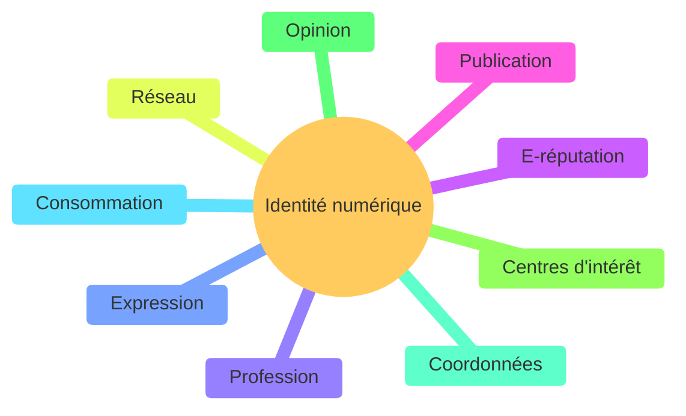

# Identité numérique

## a) Définition

L'*identité numérique* est l'ensemble des traces que nous laissons sur le web et les médias sociaux.

L'*e-réputation* est l'image associée à une identité numérique. Elle peut renvoyer une image positive ou négative selon l'identité numérique que nous avons.

Il est important de protéger son identité numérique afin de contrôler son e-réputation.