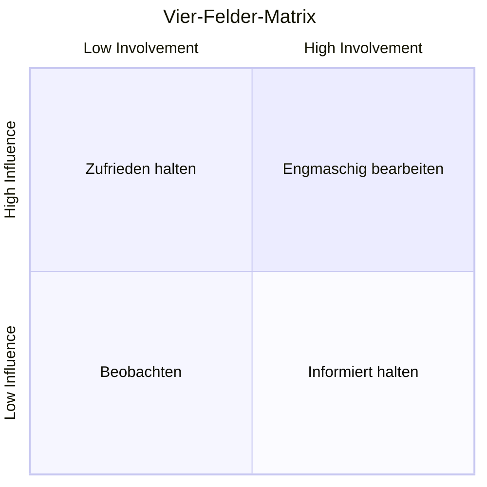

# Réseaux sociaux existants

## a) Définition

Un *réseau social* désigne un agencement de liens entre des individus ou des organisations, constituant un groupement qui a un sens : la famille, les collègues, un groupe d'amis, une communauté, etc. 

L’expression "réseau social" dans l'usage habituel renvoie généralement à celle de *médias sociaux*, qui recouvre les différentes activités qui intègrent technologie, interaction sociale entre individus ou groupes d'individus, et la création de contenu sur Internet.

## b) Activité 1

Citez le nom de média social que vous utilisez/connaissez.

## c) Activité 2

a) Parmi la liste des médias sociaux trouvés dans l'activité précédente, en choisir dix.

b) En effectuant des recherches sur le web, trouver la date de création des médias sociaux que vous avez choisi.

Puis placer les sur une frise chronologique.

c) Ajouter sur la frise et pour chaque médias sociaux le groupe industriel auquel il appartient.

d) Ajouter également sur la frise et pour chaque médias sociaux le principal usage du média.

e)

