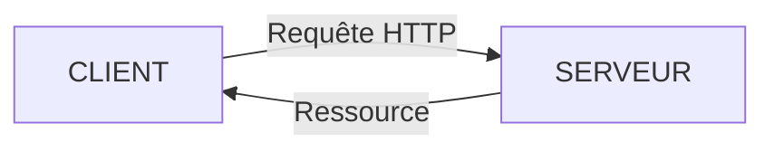

# Modèle Client-Serveur

## a) Introduction

Lorsque nous cliquons sur un lien hypertexte ou que nous entrons une adresse web sur la barre d'adresse, une page web s'affiche à l'écran.

- La page qui vient de s'afficher ne se trouve pas en réalité sur notre ordinateur, mais sur une autre machine appellée *serveur web*. Il y a donc eu une communication entre notre machine et le serveur pour récupérer les données de la page.

- Deuxièmement, notre machine n'est pas reliée directement au serveur : il n'y a pas de câble reliant directement notre ordinateur au serveur.

- Troisièmement, si nous répétons l'expérience depuis des lieux différents avec des machines différentes, la page web s'affiche pareillement.

Il y a en fait un modèle de communication, des règles auquelles les deux entités (ordinateur et serveur) se sont mises d'accord pour communiquer efficacement.

Nous appelons ce modèle : le modèle Client-Serveur.

## b) Principe

Le *client* (le navigateur) et le serveur sont deux entités qui communiquent.

Le client souhaite accèder à une ressource présente sur le serveur.

Le modèle Client-Serveur repose sur le protocole de communication HTTP (*HyperText Tansfer Protocol*) qui permet d'envoyer des requêtes HTTP et de recevoir une réponse du serveur :

## c) Requête HTTP

Le client envoie une requête HTTP au serveur contenant la ressource souhaitée.

Une requête HTTP s'écrit avec le mot-clé `GET` suivi du nom de l'adresse.

## d) Réponse 

Le serveur, s'il possède la ressource, l'envoie comme réponse à la requête à celui qui l'a demandé.

Une réponse HTTP contient de nombreuses informations comme le code réponse, la langue dans laquelle a été écrit la ressource, le nom du serveur qui héberge la ressource, la taille de la ressource, la date de la requête, etc ...

Le code réponse indique l'état de la réponse : 

- $200$ pour `OK`.
- $403$ pour `Permission refusée`.
- $404$ pour `Ressource indisponible`.

La réponse contient bien sûr le code HTML CSS permettant d'afficher la ressource sur le navigateur.

## e) Activité 1

a) Sur Mozilla Firefox, taper sur la touche `f12`. Il s'agit du panneau d'outils de développement.

b) Aller dans l'onglet `Réseau` puis sélectionner `HTML`.

c) Entrer dans la barre d'adresse l'adresse suivante : [https://www1.ac-lille.fr/](https://www1.ac-lille.fr/) et observer ce qu'il se passe.

d) En parcourant la requête HTTP et la réponse, trouver les informations suivantes :

1. Le code réponse.

2. Le type du document.

3. La taille de la ressource.

4. La langue utilisée.

5. La date de la requête.

__________

Leçon 8 : [Langages HTML et CSS](./HTML-CSS.md)