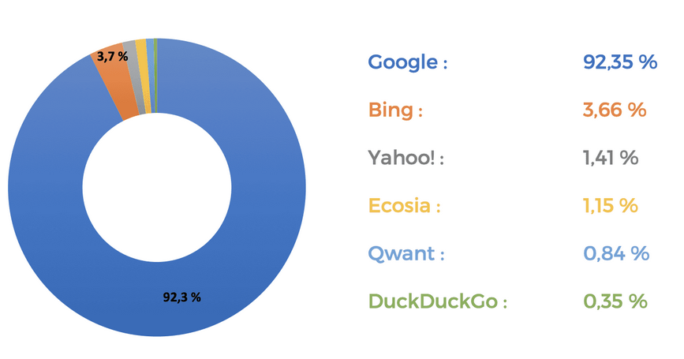
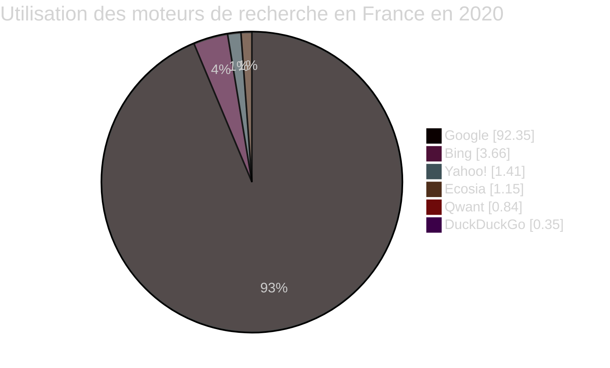
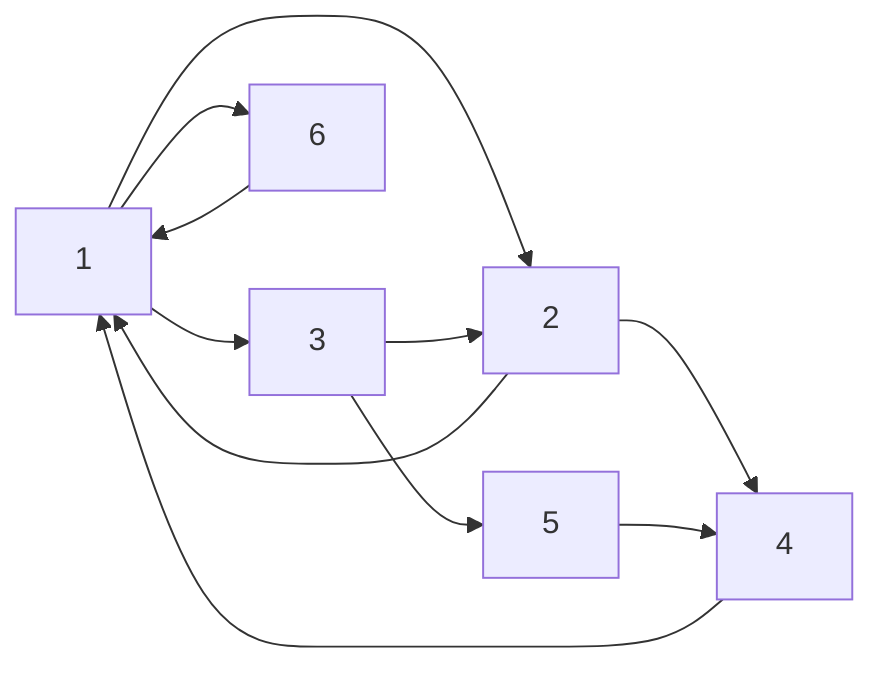
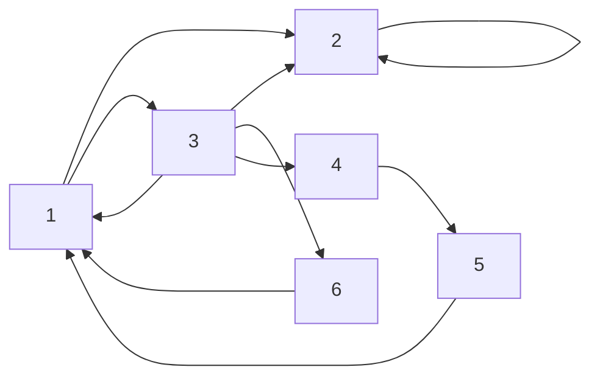
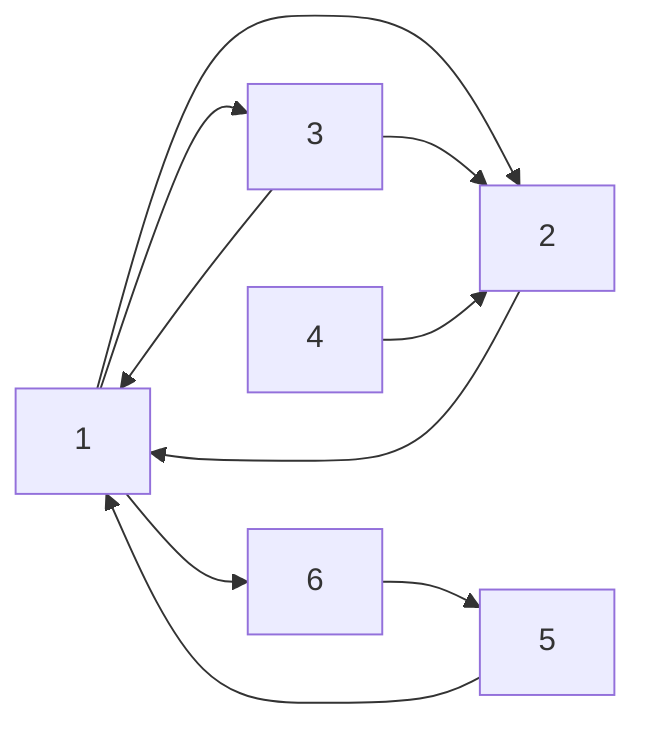

# Moteurs de recherche

## a) Définition

Un *moteur de recherche* est une application web.

Les moteurs de recherche permettent de trouver des informations dans des pages web dont nous ne connaissons pas l'adresse, voire dont nous ignorons l'existance.

Usuellement, nous tapons quelques mots-clés dans la barre de recherche et plusieurs liens hypertextes sont affichés.

Voici ci-dessous un graphique présentant la part du marché des différents moteurs de recherche en France en 2020 :

## b) Activité 1

a) Effectuer la recherche `Apollo 11` sur les trois moteurs de recherche proposés et compléter le tableau suivant avec vos résultats de recherche :

| Moteur de recherche | Présence d'une annonce de publicité en tête des résultats| Position du lien vers Wikipédia | Position du premier lien vers un média culturel | Position du premier lien vers le film Apollo 11 |
| --- | --- | --- | --- | --- |
| Google | | | | |
| Qwant | | | | |
| Yahoo! | | | | |
| DuckDuckGo | | | | |

b) Essayer d'expliquer pourquoi le classement des résultats est différent selon les moteurs de recherche.

c) Quel moteur de recherche conseillerez-vous ?

d) Pourquoi est-il important pour une page web d'être en tête d'un classement de recherche ?

## c) Des robots pour classer

Pour classifier les pages, les moteurs de recherche envoient des robots informatiques (programmes) sur le web.

Ces robots explorent en visitant les pages du web, trient et classifient les pages selon certaines informations.

Ces algorithmes de classement ne sont pas connus exactement puisqu'ils sont considérés comme des secrets industriels.

Il existe trois méthodes de tri :

- Le *tri par pertinence*, qui évalue entre autres le nombre de fois que le mot-clé recherché apparaît dans une page web.

- Le *tri par popularité*, comme le `PageRank` de Google, qui note la popularité d'une page web.

- Le *tri par rapport à l'audiance*, qui évalue le temps resté par l'internaute sur une page web.
 
## d) Activité 2

Par groupe de deux ou trois.

L'objectif de l'activité est de comprendre comment l'algorithme `PageRank` de Google parvient à trier les pages web selon leur popularité.

Ci-dessous un plateau représentant schématiquement six pages web reliées les unes aux autres par des liens hypertextes.

### Plateau 1

### Algorithme PageRank

*Matériel : un plateau, un dé et un pion.*

L'algorithme de `PageRank` consiste :

1. Choisir une page de départ aléatoirement entre toute les pages du web en lançant le dé.

2. Lancer le dé, si la page du numéro tiré est accessible :

  + Visiter cette page.

  + Augmenter le nombre de visite à cette page de $1$, et le noter.

3. Répéter l'étape $2$.

### Questions

a) Dessiner suffisamment grand le plateau $1$ sur une feuille.

b) Appliquer l'algorithme de `PageRank` sur le plateau $1$ pendant cinq minutes et donner vos résultats.

c) Donner l'ordre de popularité des pages.

d) Il est possible qu'une page web ne fasse référence vers aucune autre. Quelle page est concernée sur le plateau $2$ ci-dessous ?

### Plateau 2

e) Dessiner suffisamment grand le plateau $2$ sur une feuille.

f) Proposer une légère modification à l'algorithme pour pallier à ce problème.

g) Appliquer de nouveau l'algorithme de `PageRank` modifié pendant cinq minutes sur le plateau $2$ et donner vos résultats.

h) Donner la popularité des pages.

i) Il n'est pas impossible qu'aucune page web fasse référence vers une autre page en particulier. Quelle page est concernée sur plateau $3$ ?

### Plateau 3

j) Dessiner suffisamment grand le plateau $3$ sur une feuille.

k) Proposer une légère modification à l'algorithme pour pallier à ce problème.

l) Appliquer de nouveau l'algorithme de `PageRank` modifié pendant cinq minutes sur le plateau $3$ et donner vos résultats.

m) Donner la popularité des pages.

_______________

Leçon 5 : [Navigateurs](./Navigateurs.md)