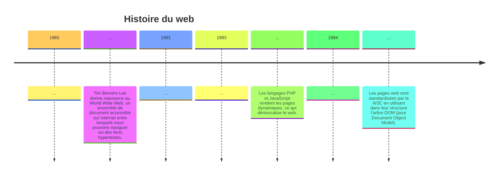

# Repères historiques

```
Anecdote : Nous estimons à 1,4 milliard le nombre de sites web créés dans le monde depuis le début du web.
```

## I. Activité 2

[Repères historiques - SNT](https://www.youtube.com/watch?v=YVn7jrDYjUQ)

a) Compléter les informations de la frise suivante à l'aide de la vidéo :


________________

[Sommaire](./../README.md)