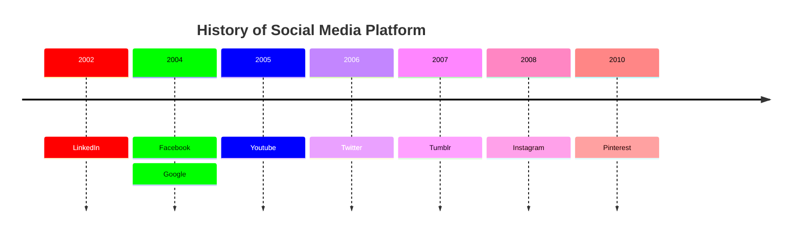

# Repères historiques

```
Anecdote : Nous estimons à 1,4 milliard le nombre de sites web créés dans le monde depuis le début du web.
```

## a) Activité 1

a) La vidéo suivante énnonce les grands repères historiques, trouver et noter ces informations sur une feuille de papier :


b) Aller sur [https://kahoot.it/](https://kahoot.it/), entrer le code PIN de la partie et votre prénom comme pseudonyme.

c) Répondre aux questions du quiz.


______________

Leçon 3 : [Hypertexte](./Hypertexte.md)